# HTML5&CSS3 basic (HTML5 和 CSS3 基础)

[Word版本]:                     Doc/HTML5-CSS3%20基础笔记.doc
[back to Contents]:            #目录contents

> 这个笔记是我几年前在网上看的一门课程的笔记（课程平台及地址已经忘了，毕竟有几年了，请谅解，如有知晓课程出处的请在 issue 中留言，非常感谢）。此笔记原为 [Word版本]，现改为 md版本，温故而知新，也便于以后的查找。  

## 目录（Contents）

* [1. HTML5](#1-html5)
    + [1.1 简化的元素](#11-简化的元素)
        * [1.1.1 Doctype 文档类型声明](#111-doctype-文档类型声明)
        * [1.1.2 Mate 声明](#112-mate-声明)
        * [1.1.3 Link 标签](#113-link-标签)
        * [1.1.4 Script 标签](#114-script-标签)
    * [1.2 新增的语义标签](#12-新增的语义标签)
        * [1.2.1 区块标签](#121-区块标签)
            * [1.2.1.1 article（文本标签）](#1211-article文本标签)
            * [1.2.1.2 header（头标签）](#1212-header头标签)
            * [1.2.1.3 footer（页脚标签名）](#1213-footer页脚标签名)
            * [1.2.1.4 nav（导航标签）](#1214-nav导航标签)
            * [1.2.1.5 aside](#1215-aside)
            * [1.2.1.6 section](#1216-section)
        * [1.2.2 内容分组标签](#122-内容分组标签)
            * [1.2.2.1 main（住内容区）](#1221-main住内容区)
            * [1.2.2.2 figure（图像） 和 figcaption（图形标题）](#1222-figure图像-和-figcaption图形标题)
        * [1.2.3 文本级别标签](#123-文本级别标签)
            * [1.2.3.1 time（时间标记）](#1231-time时间标记)
            * [1.2.3.2 i](#1232-i)
            * [1.2.3.3 b](#1233-b)
            * [1.2.3.4 em（emphasis 强调）](#1234-ememphasis-强调)
            * [1.2.3.5 strong](#1235-strong)
    * [1.3 HTML5 视屏播放](#13-html5-视屏播放)
        * [1.3.1 HTML5 之前 WEB 上的视屏格式](#131-html5-之前-web-上的视屏格式)
        * [1.3.2 embed（html4 标签）](#132-embedhtml4-标签)
        * [1.3.3 object（HTML4 标签）](#133-objecthtml4-标签)
        * [1.3.4 video 标签（HTML5 标签）](#134-video-标签html5-标签)
    * [1.4 HTML5 音频播放](#14-html5-音频播放)
        * [1.4.1 HTML5 之前 WEB 上的音频格式](#141-html5-之前-web-上的音频格式)
        * [1.4.2 几种常用的播放 MP3 音频文件的方式](#142-几种常用的播放-mp3-音频文件的方式)
        * [1.4.3 audio标签（HTML5标签）](#143-audio-标签html5标签)
    * [1.5 HTML5 表单](#15-html5-表单)
        * [1.5.1 新增 input 类型](#151-新增-input-类型)
        * [1.5.2 新增表单元素](#152-新增表单元素)
        * [1.5.3 HTML5 表单验证](#153-html5-表单验证)
            * [1.5.3.1 输入类型验证](#1531-输入类型验证)
            * [1.5.3.2 必填字段（required）](#1532-必填字段required)
            * [1.5.3.3 字符长度（minlength 和 maxlength）](#1533-字符长度minlength-和-maxlength)
            * [1.5.3.4 数值\日期和时间范围（min 和 max）](#1534-数值日期和时间范围min-和-max)
            * [1.5.3.5 步长（step）](#1535-步长step)
            * [1.5.3.6 正则表达式（pattern）](#1536-正则表达式pattern)
            * [1.5.3.7 禁用表单验证](#1537-禁用表单验证)
        * [1.5.4 新增表单属性](#154-新增表单属性)
    * [1.6 HTML5 中的全局属性](#16-html5-中的全局属性)
* [2. CSS3](#2-css3)
    * [2.1 border-radius（边框圆角属性）](#21-border-radius边框圆角属性)
    * [2.2 box-shadow（盒子阴影）](#22-box-shadow盒子阴影)
    * [2.3 CSS3 文本属性](#23-css3-文本属性)
        * [2.3.1 text-shadow（文本阴影）](#231-text-shadow文本阴影)
        * [2.3.2 text-overflow（文本溢出）](#232-text-overflow文本溢出)
        * [2.3.3 word-break 和 word-wrap（文字溢出）](#233-word-break-和-word-wrap文字溢出)
    * [2.4 CSS3 颜色属性](#24-css3-颜色属性)
        * [2.4.1 三种旧的颜色表示法](#241-三种旧的颜色表示法)
        * [2.4.2 CSS3 中新增的颜色表示法](#242-css3-中新增的颜色表示法)
        * [2.4.3 CSS 不透明度](#243-css-不透明度)
        * [2.4.4 CSS 中的渐变](#244-css-中的渐变)
    * [2.5 CSS3 中“盒子”的尺寸](#25-css3-中盒子的尺寸)
    * [2.6 CSS3 中背景的新特性](#26-css3-中背景的新特性)
        * [2.6.1 CSS3 为一个元素设置多张背景图片（background-image）](#261-css3-为一个元素设置多张背景图片background-image)
        * [2.6.2 CSS3 为图片重新定义一个尺寸（background-size）](#262-css3-为图片重新定义一个尺寸background-size)
        * [2.6.3 CSS3 中定义背景图片的定位区域（background-origin）](#263-css3-中定义背景图片的定位区域background-origin)
        * [2.6.4 CSS3 定义图片的剪裁区域（background-clip）](#264-css3-定义图片的剪裁区域background-clip)
    * [2.7 Web 字体](#27-web-字体)
    * [2.8 CSS3 中的 2D 转换](#28-css3-中的-2d-转换)
    * [2.9 CSS3 过度](#29-css3-过度)
    * [2.10 CSS3 动画](#210-css3-动画)
* [参考链接](#参考链接)

## 内容简介

HTML5的新特性：

1. 新的HTML标签和属性
2. 完全支持CSS
3. 视屏和音频标签
4. 2D/3D绘图
5. 本地缓存
6. 本地SQL数据库

CSS3：

1. 边框圆角
2. 盒模型阴影和文字模型阴影
3. 颜色、不透明和渐变
4. 多背景和背景尺寸
5. web字体
6. 2D/3D转换
7. 过度
8. 动画

## 1. [HTML5]

[HTML5]: https://developer.mozilla.org/zh-CN/docs/Web/Guide/HTML/HTML5

### 1.1 简化的元素

[Doctype]: https://developer.mozilla.org/zh-CN/docs/Glossary/Doctype
[Mate]: https://developer.mozilla.org/zh-CN/docs/Web/HTML/Element/meta
[Link]: https://developer.mozilla.org/zh-CN/docs/Web/HTML/Element/link
[Script]: https://developer.mozilla.org/zh-CN/docs/Web/HTML/Element/script

#### 1.1.1 [Doctype] 文档类型声明

HTML 4.01  

```html
<!-- HTML 4.01 严格版本（不包括 HTML 4.0 之前废弃的元素） -->
<!DOCTYPE HTML PUBLIC "-//W3C//DTD HTML 4.01//EN" 
"http://www.w3.org/TR/html4/strict.dtd">
<!-- HTML 4.01 过度版本（包括废弃的元素） -->
<!DOCTYPE HTML PUBLIC "-//W3C//DTD HTML 4.01 Transitional//EN" 
"http://www.w3.org/TR/html4/loose.dtd">
<!-- HTML 4.01 框架集 -->
<!DOCTYPE HTML PUBLIC "-//W3C//DTD HTML 4.01 Frameset//EN" 
"http://www.w3.org/TR/html4/frameset.dtd">
```

XHTML 1.0  

```html
<!-- XHTML 1.0 严格版本 -->
<!DOCTYPE HTML PUBLIC "-//W3C//DTD XHTML 1.0//EN" 
"http://www.w3.org/TR/xhtml1/DTD/xhtml1-strict.dtd">
<!-- XHTML 1.0 过度版本 -->
<!DOCTYPE HTML PUBLIC "-//W3C//DTD XHTML 1.0 Transitional//EN" 
"http://www.w3.org/TR/xhtml1/DTD/xhtml1-transitional.dtd">
<!-- XHTML 1.0 框架集 -->
<!DOCTYPE HTML PUBLIC "-//W3C//DTD XHTML 1.0 Frameset//EN" 
"http://www.w3.org/TR/xhtml1/DTD/xhtml1-frameset.dtd">
```

HTML5  

````html
<!-- 没有指定版本表示使用最新的版本 -->
<!DOCTYPE HTML>
````

> strict: 严格版本  
> Transitional: 过渡期  
> Frameset: 框架集  

[back to Contents]

#### 1.1.2 [Mate] 声明

HTML4.0 `<meta http-equiv="Content-Type" content="text/html; charset=UTF-8" />`  
HTML5 `<meta charset=”UTF-8" />`  

[back to Contents]

#### 1.1.3 [Link] 标签

HTML4.0 `<link rel="stylesheet" type="text/css" href="index.css">`  
HTML4.0 `<link rel="stylesheet" href="index.css">` (不需要 type 属性 浏览器会自动推断出 CSS 文本就是这里需要的类型)  

[back to Contents]

#### 1.1.4 [Script] 标签

HTML4.0 `<scrip type="text/javascript" src="index.js"></scrip>`  
HTML4.0 `<scrip src="index.js"></scrip>` (不需要 type 属性 浏览器会自动推断出 javascript 文本就是这里需要的类型)  

[back to Contents]

### 1.2 新增的[语义标签]

[语义标签]: https://developer.mozilla.org/zh-CN/docs/Glossary/语义
[article]: https://developer.mozilla.org/zh-CN/docs/Web/HTML/Element/article
[header]: https://developer.mozilla.org/zh-CN/docs/Web/HTML/Element/header
[footer]: https://developer.mozilla.org/zh-CN/docs/Web/HTML/Element/footer
[nav]: https://developer.mozilla.org/zh-CN/docs/Web/HTML/Element/nav
[aside]: https://developer.mozilla.org/zh-CN/docs/Web/HTML/Element/aside
[section]: https://developer.mozilla.org/zh-CN/docs/Web/HTML/Element/section
[main]: https://developer.mozilla.org/zh-CN/docs/Web/HTML/Element/main
[figure]: https://developer.mozilla.org/zh-CN/docs/Web/HTML/Element/figure
[figcaption]: https://developer.mozilla.org/zh-CN/docs/Web/HTML/Element/figcaption
[time]: https://developer.mozilla.org/zh-CN/docs/Web/HTML/Element/time
[i]: https://developer.mozilla.org/zh-CN/docs/Web/HTML/Element/i
[b]: https://developer.mozilla.org/zh-CN/docs/Web/HTML/Element/b
[em]: https://developer.mozilla.org/zh-CN/docs/Web/HTML/Element/em
[strong]: https://developer.mozilla.org/zh-CN/docs/Web/HTML/Element/strong

#### 1.2.1 区块标签

##### 1.2.1.1 [article]（文本标签）

表示一个文档、页面、应用程序或网站中的一段独立的内容，能够被独立的发布或独立使用  

article 标签的使用：博客 评论的帖子 新闻报道 用户评论等

```html
<!-- article标签的嵌套使用 -->
<article>
    文章内容
	<article>
        用户评论
	</article>
</article>
```

[back to Contents]

##### 1.2.1.2 [header]（头标签）

一般被放置在页面的顶部或摸个区块的顶部，包含整个页面或区块的标题、简介等信息  

header 标签的使  

1. 一个文档中可包含多于一个的 header 标签
2. header 标签不一定放在页面（或区块）的顶部，内容决定是否使用 header 标签，位置并不重要
3. 可为 body、article、section、和 aside 增加 header 标签

```html
<header>
    Logo
    导航条
</header>
<article>
    <header>
        文章的标题
        文章的发布时间
    </header>
    文章的内容
</article>
```

[back to Contents]

##### 1.2.1.3 [footer]（页脚标签名）

一般放置在页面的底部或莫个区块的地部  

footer 标签的使用

```html
<article>
    <header>
        文章的标题
        文章的发布时间
    </header>
    <p>文章的内容</p>
    <footer>阅读XX人 s评论XX人</footer>
</article>
```

[back to Contents]

##### 1.2.1.4 [nav]（导航标签）

表示页面的导航，可以通过导航链接到网站的其他页面或当前页面的其他部分  

nav 标签的使用

1. 页面中独立的导航区域
2. 头部导航区域的一部分
3. 显示在侧边栏中
4. 可以在一个页面中使用多个nav标签

```html
<header>
    <nav>
        <ul>
            <li></li>
            <li></li>
        </ul>
    </nav>
</header>
```

> PS：搜索引擎会根据 nav 标签的内容确定网页的内容，因此如登录信息、版权声明等内容不适合放在 nav 标签中。

[back to Contents]

##### 1.2.1.5 [aside]

包含的内容不是页面的主要内容，具有独立性，是对页面内容的补充  

Aside 标签的使用

1. 页面侧边栏
2. 广告
3. 友情链接
4. 文章引语（内容再要）

```html
<aside>
    侧边栏内容
</aside>
```

[back to Contents]

##### 1.2.1.6 [section]

表示一个主题性的内容分组，通常包含一个头部（header），可能还有一个尾部（footer）  

> PS：section 类似于 div 标签都是区分不同的内容，但 div 标签的适用范围更广，只想给莫一内容一个单独的样式都可以使用 div 标签，而 section 包含一个明确的主题，通常有标题区域

section 标签的使用

```html
<section>
    <h3>标题</h3> //通常会在section标签类放标题标签
    区块内容
</section>
<section>
    <header>
    <h3>标题</h3> //如果标题比较复杂可将标题放在header标签中
    </header>
    区块内容
</section>
```

[back to Contents]

#### 1.2.2 内容分组标签

##### 1.2.2.1 [main]（住内容区）

显示页面的主题内容  

main 标签的使用

每个页面只能包含一个 main 标签
Main标签不包含网页的标题、logo、主导航、版权声明等信息

[back to Contents]

##### 1.2.2.2 [figure]（图像） 和 [figcaption]（图形标题）

figure 和 figcaption 标签的用法

```html
<figure>
    		//图片
    <figcaption>内容</figcaption>
</figure>
<!--  也可以为 video（视屏标签，下有详细讲解） -->
```

[back to Contents]

#### 1.2.3 文本级别标签

##### 1.2.3.1 [time]（时间标记）

表示一个日期或一个时间或者同时表示一个日期和时间值  

time 标签的使用

`<time datetime=”2015-6-30”>2015年6月30日</time>`  
`datatime` 是一个重要的属性，是一个固定格式的日期或时间格式，可以被搜索引擎、屏幕阅读器方便的识别和使用  

> PS：如果定义了 datetime 属性，则 time 标签间的内容只要人能理解就可以不一定为时间，如：`<time datetime=”2015-6-30”>结婚纪念日</time>` 如果没有定义 datetime 属性，time 标签间的内容是一个固定格式，方便搜索引擎和屏幕阅读器正确识别日期和时间值

time 的格式：

* 指定年月日：2015-6-30
* 指定年月：2015-6
* 年份可以是两位数字：15-6-30
* 指定时间（二十四小时制）：14:59:12
* 指定时间（二十四小时制）：14:59
* 指定日期和时间：2015-6-30 14:59:12 //注意空格
* T 表示时间（意义同上）：2015-6-30T14:59:12
* Z 表示 UTC 标准时间：2015-6-30T14:59:12Z // UTC 标准时间+8小时=北京时间

[time 格式参考](https://www.w3.org/TR/html/text-level-semantics.html#the-time-element)

[back to Contents]

##### 1.2.3.2 [i]

html4 中修饰文本样式，将文字显示为 斜体 文本  
Html5 表示不同的情绪或声音，也可以表示技术术语、生物类、来自另一种语言的	成语或习语、一个想法等等。  

i 标签的用法

```html
<p><i>家猪</i>是一种可爱的动物</p>
<p><i>Thank god</i>项目终于按时交付了</p>
<p><i>我希望这次可以成功</i>，他想</p>
```

[back to Contents]

##### 1.2.3.3 [b]

html4 修饰文字样式，将文字显示为 粗体 文本  
html5 显示文本中的关键字、商品名称等  

b 标签的使用

```html
<p>
    该地出产的咖啡：
    <B>星巴克家常咖啡豆</B>,<B>浓缩烘培</B>
</p>
```

[back to Contents]

##### 1.2.3.4 [em]（emphasis 强调）

标签中的内容是强调的重点内容，在浏览器中显示为 斜体  

em 标签的用法

```html
<p><em>猫</em>是可爱的动物</p>	//强调”猫“，”猫“斜体显示
<p>猫是<em>可爱</em>的动物</p>	//强调”可爱“，”可爱“斜体显示
```

[back to Contents]

##### 1.2.3.5 [strong]

表示非常重要、严重性或内容的紧迫性，在浏览器中显示为 粗体  

strong 标签的用法

```html
<strong>警告：水深危险！</strong>
```

> PS：如果只是想将文字显示为斜体或粗体请不要使用这些标签，W3C 建议在 CSS 样式表中定义文字样式  

[back to Contents]

### 1.3 HTML5 视屏播放

[使用 HTML5 音频和视频]: https://developer.mozilla.org/zh-CN/docs/Web/Guide/HTML/Using_HTML5_audio_and_video
[embed]: https://developer.mozilla.org/zh-CN/docs/Web/HTML/Element/embed
[object]: https://developer.mozilla.org/zh-CN/docs/Web/HTML/Element/object
[video]: https://developer.mozilla.org/zh-CN/docs/Web/HTML/Element/video

[使用 HTML5 音频和视频]

#### 1.3.1 HTML5 之前 WEB 上的视屏格式

> HTML5之前，浏览器要想播放视屏，必须预先安装对应的浏览器插件。

| 格式 | 文件 | 描述
| :-: | :-: | :-- |
| AVI | .AVI | AVI(Audio Video Interleave)格式是有微软开发的，但非 windows 计算机并不总是能够播放。
| WMV | .WMV | Windows media 格式是有微软开发的，视屏在所有非windows计算机上都无法被放，因为没有合适的播放器。
| QuickTime | .mov | QuickTime 格式是苹果公司开发，是 web 上常见的视屏格式。
| RealVideo | .rm .ram | RealVideo 格式由 Real Media 针对 web 开发的，改革是允许低带宽条件下（在线视屏、网络电视）的视屏流/由于低带宽优先质量常会降低
| Mpeg-4 | .MP4 | Mpeg-4（H.264）是跨平台的国际标准，由（Moving Picture Experts Group 动态图像专家组）于1998年制定，是一种专门属于对 web 的视屏格式，目标是以最少的数据获得最佳的图像质量，得到了所有最流行的浏览器的支持。
| Flash | .swf .flv | Flash(Shockwave)格式由 Macromedia 开发的，是在 HTML5 之前非常流行的视屏格式，已经成为事实的标准。很多视屏网站在 html 中插入 flash 视屏播放器，通过 flash 视屏播放器播放 mpeg-4 格式的视屏文件，但是由于性能的原因，flash 已经不被 ipad、iphone 和很多的安卓设备所支持。

[back to Contents]

#### 1.3.2 [embed]（html4 标签）

不是 web 的标准

embed 标签的使用

```html
<!-- 用于加载 flash 插件以及 flash 视屏 -->
<embed type=”application/x-shockwave-flash”
Src=”zq.swf width=”500” height=”430””></embed>
```

**type**: 指定要加载的插件  
**src**: 视屏的 URL 地址  
**width 和 height**: 决定大小  
**此方法兼容所有的浏览器，但不是 web 的标准**

[back to Contents]

#### 1.3.3 [object]（HTML4 标签）

> **常用 但在低版本IE中无法工作【<=IE8】**

object 标签的使用（与 embed 标签类似）：

```html
<object type=”application/x-shockwave-flash”
data=”zq.swf width=”500” height=”430””></object >
```

**type**: 指定要加载的插件  
**data**: 视屏的 URL 地址  
**width 和 height**: 决定大小
**在低版本IE中无法工作【<=IE8】**

[back to Contents]

##### 1.3.3.1 兼容低版本IE(<=IE8)

```html
<object classid=”cisd:D27CDB6E-AE60-IICF-9688=444553540000” width=”500” height=”430””>
  <param name=”src” value=”zq.swf”>
</object>
```

**classid**: 指定要加载的插件  
**`<para>`**: 标签指定视屏的 URL 地址，且只能在低版本IE（<=IE10）中正常工作，无法在任何其他浏览器上工作。  

[back to Contents]

##### 1.3.3.2 兼容所有的浏览器

1. 将 object 标签嵌套使用

```html
<!-- 兼容高版本IE和其他浏览器 -->
<object classid="clsid:D27CDB6E-AE6D-11cf-96B8-444553540000"
    width="500" height="430">
    <param name="src" value="zq.swf" />//兼容低版本IE
    <object type="application/x-shockwave-flash"
        data="zq.swf" width="500" height="430">
    </object>
</object>
```

2. 使用 object 标签和 embed 标签

```html
<!-- 兼容所有浏览器 -->
<object classid="clsid:D27CDB6E-AE6D-11cf-96B8-444553540000"
    width="500" height="430">
    <param name="src" value="zq.swf" />
    <embed type="application/x-shockwave-flash"
        src="zq.swf" width="500" height="430">
    </embed>
</object>
```

3. 播放 mp4 文件

```html
<!-- 使用 embed 标签播放 mp4 文件（有的浏览器内置了插件，有的需要下载，不方便） -->
<embed src="lesson-0.mp4" autostart="false" width="640" height="360"></embed>
<!--autostart="false"  设置不自动播放，只在 IE 中有效-->

<!-- 使用 object 标签播放 mp4 文件（IE8 及以下不可用） -->
<object data="lesson-0.mp4" width="640" height="360"></object>

<!-- 使用 object 标签播放 mp4 文件（只用于 IE，需要下载插件，其他浏览器不可用） -->
<object width="640" height="360"                    classid="clsid:02BF25D5-8C17-4B23-BC80-D3488ABDDC6B" codebase="http://www.apple.com/qtactivex/qtplugin.cab">
     <param name="src" value="lesson-0 ">
</object>
```

> 总结  
>   很乱。。很乱。。其实兼容性最好的方式是使用 embed 标签播放 flash。。但是 flash 已经被苹果抛弃。。

[back to Contents]

#### 1.3.4 [video] 标签（HTML5 标签）

**优点**：  

1. 不需要下载任何额外的浏览器视屏播放插件
2. 完全由浏览器自身实现视屏的解码和播放

video 标签的属性：  

**src**：指定视屏的 URL 地址
**controls**：是浏览器显示一组视屏播放组建，不同浏览器中视屏播放组建不同，可用 javascript 定制视屏播放组建可使外观一致。`<video src=”lesson.mp4” controls></video>`  
**autoplay**：页面加载后自动播放视屏（不建议使用）`<video src=”lesson.mp4” controls autoplay></video>`  

> controls 和 autoplay 都是 bool 属性，只有属性名无属性值  
> 如果有 autoplay 属性，视屏自动播放；如果没有 autoplay 属性，则视屏不会自动播放  
> 支持 XHTML 风格代码(属性必须由属性名和属性值构成)，因此可以写成：`controls=”controls”` `autoplay=”autoplay”`  

**preload**：有三个属性值（`none`、`metadata`、`auto` （默认值））  

preload 三个属性使用详情：

| 属性值 | 详细说明 |
| :--: | ------- |
| None | 视屏播放前，浏览器不会先下载视频资源。当用户不点击播放按钮时会节省带宽，适用于 移动端无 Wi-Fi 的场景
| Metadata | 视屏播放前，浏览器不会先下载视频资源，但会获取视屏资源的元数据（视屏大小、持续时间、视屏格式、前几帧画面）
| Auto （默认值） | 浏览器会根据实际情况（如 Wi-Fi、3G、4G 数据漫游）动态采取不同的加载方案

> 如果设置了 autoplay 属性那么 preload 属性会被忽略  
> `preload=”auto”` 与 `preload` 的意思相同

**muted**：添加后视屏默认静音播放  
**loop**：添加后会循环播放视屏  
**poster**：为视屏指定封面（封面：视屏播放前的画面）`<video serc=”lesson.mp4 poster=”lesson.jpg””...></video>`  
**width 和 height**：设置视屏播放器的宽和高  

视屏文件的格式：  

1. MP4 H.264 视屏编码 + ACC 音频编码 扩展名：.mp4
2. Web, Vp8 视屏编码 + Vorbis 音频编码 扩展名：.eebm
3. Ogg Theora 视屏编码 + Vorbis 音频编码 扩展名：.ogv

> 浏览器对视屏格式的支持情况可在[此处](https://caniuse.com/#search=video)查询。目前 mp4 格式文件是做好的选择

[back to Contents]

##### 1.3.4.1 HTML5 视屏格式兼容之旅

1. source 标签能提供一组视屏供浏览器选择，浏览器会选择它支持的第一种格式践行播放

```html
<video controls>
    <source src="tweetsip.mp4"'>
    <source src="tweetsip.webm"'>
    <source src="tweetsip.ogv">
    <p>对不起，您的浏览器不支持 video 标签</p>
</video>
```

对于每一个 source 浏览器会加载视屏的元数据查看浏览器是否能播放这个视屏，这个过程可能消耗时间。

2. `<source src="tweetsip.mp4" type='video/mp4; codecs="avc1.42E01E, mp4a.40.2"'>` 使用 `type` 属性向浏览器提供提示 帮它确能不能播放这种格式的文件。先指定文件的 MIME 类型（视屏格式），在 `codecs` 属性中注明视屏和音频文件的编解码器，如果不清楚视频的编解码参数可以不使用 `codecs` 参数，但会都性能造成影响，但不会太大。
3. 如果浏览器不支持 video 标签(如：IE<=IE8)，则需在 video 标签中加入 embed 或 object 标签

```html
<video controls>
    <source src="tweetsip.mp4" type='video/mp4;codecs="avc1.42E01E, mp4a.40.2"'>
    <source src="tweetsip.webm" type='video/ogg; codecs="vp8,vorbis"'>
    <source src="tweetsip.ogv" type='video/ogg; codecs="theora,vorbis"'>
    <p>对不起，您的浏览器不支持video标签</p>
    <!--<embed src="tweetsip.swf" type="application/x-shockwave-flash"></embed>-->
</video>
```

[back to Contents]

### 1.4 HTML5 音频播放

[audio]: https://developer.mozilla.org/zh-CN/docs/Web/HTML/Element/audio

[使用 HTML5 音频和视频]

#### 1.4.1 HTML5 之前 WEB 上的音频格式

> HTML5之前，浏览器要想播放音屏，必须预先安装对应的浏览器插件。

| 格式 | 文件 | 描述 |
| :-: | :-: | ---- |
| MIDI | .mid .nidi | MIDI(Musical Instrument Digital interface)是一种针对电子音乐设备的格式，MIDI 文件不含有真实的声音，只包含数字音乐命令，可被电子设备（如声卡）播放。因为 MIDI 格式仅包含命令，所以 MIDI 文件极其小巧，大多数浏览器都支持 MIDI。
| RealAudio | .rm .ram | RealAudio 格式是 Real Audio 针对因特网开发的，改革是也支持视屏，改革是允许低带宽吓得音频流（在线音乐、网络音乐），由于是低带宽优先的质量常会降低。
| Wave | .Wav | Wave（Waveform）格式是由 IBM 和微软开发的，所有网络浏览器（Google、Chrome 除外）都支持它。
| WMA | .wma | WMA 格式（Windows Media Audio），质量优于 MP3，兼容大多数播放器，除了 ipad。MWA 文件可作为连续的数据流来传输，它对网络电台、在线音乐很实用。
| MP3 | .mp3 .mpga | MP3 文件实际上是 MPEG 文件的声音部分，MPEG 文件最初是由动态图像传剑祖开发的，MP2 是其中最受欢迎的针对音乐的声音格式，期待未来的软件都支持。

[back to Contents]

#### 1.4.2 几种常用的播放 MP3 音频文件的方式

```html
<!--兼容所有的浏览器-->
<embed src="YouAreMySunshine.mp3"></embed>

<!--兼容所有的浏览器（IE低版本（<=IE8）不适用）-->
<object data="YouAreMySunshine.mp3"></object>

<!--适用于IE-->
<object classid="clsid:02BF25D5-8C17-4B23-BC80-D3488ABDDC6B"    codebase="http://www.apple.com/qtactivex/qtplugin.cab">
    <param name="src" value="YouAreMySunshine.mp3">
    <param name="controller" value="true">
</object>

<!-- flash 音乐播放器 flash 播放银屏较复杂，仅供参考 -->
<object classid="clsid:D27CDB6E-AE6D-11cf-96B8-444553540000" codebase="http://fpdownload.macromedia.com/pub/shockwave/cabs/flash/swflash.cab#version=8,0,0,0" width="360" height="26">
    <param name="movie" value="player_S.swf" />
    <param name="quality" value="high" />
    <param name="allowScriptAccess" value="always" />
    <param name="wmode" value="transparent">
    <embed src="player_S.swf" quality="high"
         type="application/x-shockwave-flash"
         WMODE="transparent" width="360" height="26"
         pluginspage="http://www.macromedia.com/go/getflashplayer"
         allowScriptAccess="always" />
</object>
```

[back to Contents]

#### 1.4.3 [audio] 标签（HTML5标签）

**优点**：  

1. 不需要下载任何额外的浏览器音频播放插件
2. 完全由浏览器自身实现音频的解码和播放

audio标签的属性（与video标签用法相同）：

**src**: 指定视屏的URL地址
**controls**: 是否显示一组音乐播放插件
**autoplay**: 页面加载时是否自动播放音频
**preload**: 有三个属性值（`none`、`metadata`、`auto` （默认值））  

preload 三个属性使用详情：

| 属性值 | 详细说明 |
| :--: | ------- |
| None | 音频播放前，浏览器不会先下载音频资源。当用户不点击播放按钮时会节省带宽，适用于 移动端无 Wi-Fi 的场景
| Metadata | 音频播放前，浏览器不会先下载音频资源，但会获取音频资源的元数据（音频大小、持续时间、音频格式）
| Auto （默认值） | 浏览器会根据实际情况（如 Wi-Fi、3G、4G 数据漫游）动态采取不同的加载方案

**muted**：静音播放
**loop**：循环播放

HTML支持的音频格式

| 容器 | 格式 | 文件 | MIME 类型 | 编解码器 |
| :-: | :-: | :-: | :-------: | :-----: |
| MP3 | MP3 | .mp3 | Audio/mpeg | mp3
| MP4 | AAC AAC+ | .mp4 .m4a .aac | Audio/mp4 | Mp4a.40.5
| OGA/DGG | Ogg Vorbis | .ogg .oga | Audio/ogg | Vorbis
| WAV | PCM | .WAV | Audio/mav | 1

> 浏览器对音屏格式的支持情况可在[此处](https://en.wikipedia.org/wiki/HTML5_Audio)查询。

[back to Contents]

##### 1.4.3.1 HTML5 音频格式兼容之旅

为了兼容所有支持 audio 标签的浏览器需要至少两种格式的音频文件，如：.mp3 和.ogg

```html
 <audio controls>
    <source src="YouAreMySunshine.mp3" type='audio/mpeg;codecs="mp3"'>
    <source src="YouAreMySunshine.ogg" type='audio/ogg;codecs="vorbis"'>
    <p>对不起，您的浏览器不支持audio标签</p>
</audio>

<!-- 兼容所有的浏览器 -->
<audio controls>
    <source src="YouAreMySunshine.mp3" type='audio/mpeg;codecs="mp3"'>
    <source src="YouAreMySunshine.ogg" type='audio/ogg;codecs="vorbis"'>
    <!--flash 音乐播放器代码-->
</audio>
```

[back to Contents]

### 1.5 HTML5 [表单]

[表单]: https://developer.mozilla.org/zh-CN/docs/Web/HTML/Element/form
[input]: https://developer.mozilla.org/zh-CN/docs/Web/HTML/Element/input
[Datalist]: https://developer.mozilla.org/zh-CN/docs/Web/HTML/Element/datalist
[Keygen]: https://developer.mozilla.org/zh-CN/docs/Web/HTML/Element/keygen
[output]: https://developer.mozilla.org/zh-CN/docs/Web/HTML/Element/output
[表单验证]: https://developer.mozilla.org/zh-CN/docs/Web/Guide/HTML/HTML5/Constraint_validation
[required]: https://developer.mozilla.org/zh-CN/docs/Web/HTML/Element/input#attr-required
[minlength]: https://developer.mozilla.org/zh-CN/docs/Web/HTML/Element/input#attr-minlength
[maxlength]: https://developer.mozilla.org/zh-CN/docs/Web/HTML/Element/input#attr-maxlength
[min]: https://developer.mozilla.org/zh-CN/docs/Web/HTML/Element/input#attr-min
[max]: https://developer.mozilla.org/zh-CN/docs/Web/HTML/Element/input#attr-max
[step]: https://developer.mozilla.org/zh-CN/docs/Web/HTML/Element/input#attr-step
[pattern]: https://developer.mozilla.org/zh-CN/docs/Web/HTML/Element/input#attr-pattern
[正则表达式]: https://github.com/ChanMenglin/NoteBook/blob/master/Regex(正则表达式)/正则表达式语法速查手册.md
[novalidate]: 

#### 1.5.1 新增 [input] 类型

Input 标签原有的 type 属性值

1. **text**（普通文本框，默认值）
2. **password**（密码框）
3. **radio**（单选按钮）
4. **checkbox**（多选按钮）
5. **file**（文件上传组建）
6. **button**（普通按钮）
7. **submit**（提交按钮）
8. **reset**（重置按钮）
9. **image**（图片按钮）
10. **hidden**（隐藏文本域）

HTML5 中 input 标签新增的 type 属性

1. **search**（搜索框）看起来像是一个文本输入框，可以输入一行普通的文本，可以用它表示一个搜索框
2. **email**（邮件地址舒入框）看起来像是一个文本输入框，可以输入一个电子邮件地址
3. **url**（url地址输入框）看起来像是一个文本输入框，可以输入一个URL地址
4. **tel**（电话号码输入框）看起来像是一个文本输入框，可以输入一个电话号码
5. **number**（数字输入框）用于输入一个数值，部分浏览器在输入框的右侧有一组上下箭头，用于控制文本框中数值的大小
6. **range**（滚动条）通过滑动条在限定范围内选择一个数值
7. **date**（日期选择）在一个弹出的日历中选择日期
8. **month**（月份选择）在一个弹出的日历选择一个具体的月份
9. **week**（周选择）在一个弹出的日历选择一个具体的星期
10. **time**（时间选择）在一个弹出的日历中选择一个具体的时间
11. **datetime-local**（日期时间）选择日期和时间（本地时间）
12. **datetime**（包含时间）选择日期和时间（UTC世界标准时间）
13. **color**（颜色选择）在弹出的颜色面板中选择一个颜色

[back to Contents]

#### 1.5.2 新增表单元素

1. **[Datalist]** 标签（为其他输入控件提供一个预定义的选项列表）

> datalist 列表中的值仅为输入建议，用户也可以填写一个其他的值

datalist 标签的使用

```html
<input type="text" list="browsers" id="t" multiple >
<datalist id="browsers">// list 值与 id 值相同，以关联 text 输入框和 datalist 列表
   <option value="Chrome">
   <option value="Firefox">
   <option value="Internet Explorer">
   <option value="Opera">
   <option value="Opera mini">
   <option value="Safari">
   //用 option 标签提供一组列表值
</datalist>
```

[back to Contents]

2. **[Keygen]** 标签（用于客户端访问服务器的安全验证，如 web 支付
当提交表单时，会生成两个键，一个私钥，一个公钥，私钥存储于客户端，公钥被发送到服务器，公钥可用于验证用户的客户端证书）

> 由于浏览器的支持不好，这里不做深入讲解，可查询 web 安全相关知识进一步学习

keygen 标签的使用

```html
<form action="#" method="get">
    用户名: <input type="text" name="usrname">
    加密: <keygen name="security">
    <input type="submit">
</form>
```

3. **[output]** 标签（主要用于显示 javascript 脚本输出）

output标签的使用

```html
<form oninput="x.value=a.value">
    <input type="range" name="a" value="0">
    <output name="x" >0</output>
</form>
```

[back to Contents]

#### 1.5.3 HTML5 [表单验证]

> 表单验证：在用户提交表单之前确保用户输入的数据是合法和有效的  
>
> * [输入类型验证](#1531-输入类型验证)：number、email、url  
> * [必填字段验证](#1532-必填字段required)：required  
> * [字符长度验证](#1533-字符长度minlength-和-maxlength)：minlength、maxlength  
> * [设置数值范围](#1534-数值日期和时间范围min-和-max)：min、max  
> * [设置日期和时间范围](#1534-数值日期和时间范围min-和-max)：min、max  
> * [设置步长](#1535-步长step)：step  
> * [正则表达式验证](#1536-正则表达式pattern)：pattern  
> * [禁用表单验证](#1537-禁用表单验证)：novalidate、formnovalidate  

[back to Contents]

##### 1.5.3.1 输入类型验证

浏览器会根据 type 属性的值验证输入的内容是否合法，如不合法会有相应的提示信息。当字段为空时表单验证不会进行，只有在用户输入内容后才会进行判断

```html
<form action="success.html" method="post">
    <div>数字：<input type="number"></div>
    <div>邮箱：<input type="email"></div>
    <div>网址：<input type="url"></div>
    <div><input type="submit"></div>
 </form>
```

[back to Contents]

##### 1.5.3.2 必填字段（[required]）

required 是 boolean 类型的属性，表示该字段为必填内容，所有 input 属性都可以添加 required 属性（type属性值为 button、submit、reset、image 时除外）

```html
<form action="success.html" method="post">
    <div>姓名：<input type="text" required></div>
    <div>年龄：<input type="number" required></div>
    <div><input type="submit"></div>
 </form>
 // 当用户不填写姓名或年龄而直接提交表单时，会提示字段不能为空
```

[back to Contents]

##### 1.5.3.3 字符长度（[minlength] 和 [maxlength]）

minlength 表示最短字符的限定，当未达到最短字符限定长度时浏览器会提示位数不够  
maxlength 表示最长字符限定，当达到最长字符限定时浏览器会禁止用户输入  
很多 input 元素的共有属性：text、search、password、email、url、tel  

```html
<!--minlength 和 maxlength：最小长度和最大长度-->
<!--minlength很多浏览器没有实现，可以用Google Chrome测试，但提示信息没有被本地化（版本40）-->
<form action="success.html" method="post">
    <div>密码：<input type="password" minlength="6" maxlength="10"></div>
    <div><input type="submit"></div>
</form>
// 输入长度限定在 6-20 位之间（包含边界）
```

[back to Contents]

##### 1.5.3.4 数值\日期和时间范围（[min] 和 [max]）

min 输入的数值的最小限定值  
max 输入的数值的最大限定值  
当用户输入的值不在限定范围内，浏览器会有相应的提示  
可以限定 number、range 和日期和时间类型的值  

```html
<form action="success.html" method="post">
    <div>订购数量：<input type="number" min="5" max="10"></div>
    <div><input type="submit"></div>
</form>//限定值在5-110之间（包含边界）

<form action="success.html" method="post">
    <div>送货日期：<input type="date" min="2020-01-01" max="2020-01-10"></div>
    <div>送货时间：<input type="time" min="08:00" max="17:00"></div>
    <div><input type="submit"></div>
</form>
```

[back to Contents]

##### 1.5.3.5 步长（[step]）

步长，即每次增长的数值大小，适用于 number、range 数字类型

step 限定数值变化的步长

```html
<form action="success.html" method="post">
    <div>订购数量：<input type="number" min="10" max="50" step="10"></div>
    <div><input type="submit"></div>
</form>//在number输入框中，点击右侧的箭头，每次增加或减少一个补偿的值

<form action="success.html" method="post"oninput="out.value=count.value">
    <div>
        订购数量：<input name="count" type="range"
                    value="10" min="10" max="50" step="10">
        <output name="out">10</output>
    </div>
    <div><input type="submit"></div>
</form>
//range 滑动条中，拖动滑块，每次改变一个步长的值
```

[back to Contents]

##### 1.5.3.6 [正则表达式]（[pattern]）

pattern 值为正则表达式，当用户输入的内容不符合正则表达式时浏览器会提示错误信息  
pattern 属性是所有可输入 input 元素的共有属性  

```html
 <!--pattern属性中需要一个正则表达式-->
<form action="success.html" method="post">
    <div>编号：<input type="text" pattern="[0-4]{3}"></div>
    <div><input type="submit"></div>
</form>
// 当用户输入的内容不符合正则表达式时浏览器会提示错误信息
```

[back to Contents]

##### 1.5.3.7 禁用表单验证

如果使用基于 javascript 的更强大和灵活的表单验证功能，那么要禁用 HTML5 表单验证

1. [novalidate] 属性

在 form 元素中使用 novalidate 就不会验证数字、邮箱和网址

```html
<form action="success.html" method="post" novalidate>
    <div>数字：<input type="number"></div>
    <div>邮箱：<input type="email"></div>
    <div>网址：<input type="url"></div>
    <div><input type="submit"></div>
</form>
// 浏览器不会对用户输入进行验证，novalidate 属性放在 form 标签中
```

2. formnovalidate 属性

在提交按钮中使用 formnovalidate 就不会验证数字、邮箱和网址

```html
<form action="success.html" method="post">
    <div>数字：<input type="number"></div>
    <div>邮箱：<input type="email"></div>
    <div>网址：<input type="url"></div>
    <div><input type="submit" formnovalidate></div>
</form>
// 浏览器不会对用户输入进行验证，formnovalidate 属性放在 submit 按钮中
```

[back to Contents]

#### 1.5.4 新增表单属性

> 以下新增属性在 [HTML5 表单验证](#153-html5-表单验证)中已提及
>
> * [list](#152-新增表单元素)
> * [required](#1532-必填字段required)
> * [minlength 和 maxlength](#1533-字符长度minlength-和-maxlength)
> * [min 和 max](#1534-数值日期和时间范围min-和-max)
> * [step](#1535-步长step)
> * [pattern](#1536-正则表达式pattern)
> * [novalidate 和 formnovalidate](#1537-禁用表单验证)

[back to Contents]

##### 1.5.4.1 placeholder（文本框默认值）

为文本框设置默认值  
用户输入文部时自动隐藏，用户清除文本时自动显示  
适用于：text、search、url、tel、email、number、以及 password  
`<input type="text" placeholder="请输入姓名">`  

[back to Contents]

##### 1.5.4.2 autofocus（自动获取焦点）

autofocus 属性是一个 boolean 属性  
表单控件会在页面加载时自动获取焦点  
适用于 text、search、url、tel、email、number、password、日期时间控件  
一个页面只能有一个 aurofocurs 属性（如果有多个，只有第一个会被应用）  
`<input type="text" autofocus>// 在页面加载时 text 文本款就会获得焦点`  

[back to Contents]

##### 1.5.4.3 autocomplete（自动完成）

autocomplete 的值为 `on`（默认值）时，表示开启自动完成，浏览器会自动保留填写记录，下次填写时可选择已有记录快速填写  
Autocomplete 的值为 `off` 时，表示关闭自动完成，浏览器不会保留填写记录。  
Autocomplete 支持所有可输入标签  

```html
<form action="success.html" method="post" autocomplete="off">
    <input placeholder="用户名" name="username" autocomplete="on">
    // 写在 input 标签上会覆盖 form 中的 autocomplete 属性
    <input placeholder="卡号" name="cardid">
    <input type="submit">
</form>
```

[back to Contents]

##### 1.5.4.4 multiple（多选）

HTML4 中用于 select 标签，一个单选列表变成一个多选列表

```html
<select multiple>
    <option>美式咖啡</option>
    <option>卡布奇诺</option>
    <option>拿铁</option>
    <option>摩卡</option>
</select>
// 按住 ctrl 键可多选
```

HTML5 中的新功能

```html
<input placeholder="请输入邮件地址" type="email" list="contacts" multiple>
// multiple 属性使 email 输入框可输入多个 email 地址
<datalist id="contacts">
    <option value="helen@qq.com">
    <option value="huan@baidu.com">
    <option value="hello@sina.com">
    <option value="hi@qq.com">
</datalist>
// datalist 是 input 元素的输入建议列表

<input type="file" multiple> 
// mutiple 可使 file 上传控件同时上传多个文件
```

[back to Contents]

##### 1.5.4.5 form 属性

```html
<form action="success.html" id="f">
    <input placeholder="用户名 type="text" name="username">
    <input type="submit">
</form>
<input placeholder="卡号" type="text" name="cardid" form="f">
//此 input 标签在 form 表单外，如果此 input 标签没有 form 属性则提交表单时不会提此 input 标签，但有了 form 属性后就可以与 form 标签中的元素一同提交，
// form 标签中的 id 值与此 input 中的 form 属性的值必须相同。
```

##### 1.5.4.6 formaction（页面提交的地址）

表单提交按钮的属性

##### 1.5.4.7 formmethod（页面提交的方式）

表单提交按钮的属性

##### 1.5.4.8 formenctype（页面提交时的编码方式）

仅限于 post 方式提交的表单  
表单提交按钮的属性  

##### 1.5.4.9 formtarget（页面提交的窗口）

表单提交按钮的属性

```html
<form action="success.html"
      method="post"
      target="_blank"
      enctype="application/x-www-form-urlencoded">
    <!--其它表单控件-->
    <input type="submit">
</form>
// action、method、target、enctype 为 HTML4 中的属性，功能与以上四个属性一一对应

<form>
    <input type="submit"
        formaction="success.html"
        formmethod="post"
        formtarget="_blank"
        formenctype="application/x-www-form-urlencoded">
</form>
// 当 form 标签和 submit 按钮中同时出现相同功能的按钮时，以 submit 按钮的属性值为准。
```

[back to Contents]

### 1.6 HTML5 中的全局属性

| 属性 | 描述 | 属性 | 描述 |
| :-: | --- | :-: | --- |
| Type | 元素的内联样式 | Translate (new) | 元素的值在页面载入时是否需要翻译
| Class | 元素的类名 | Contentedtable (new) | 是否可编辑元素的内容
| Id | 元素的唯一id | Spellcheck (new) | 检测元素是否拼写错误
| Title | 鼠标悬停时弹出提示 | Hidden (new,js) | Hidden属性规定对元素进行隐藏
| Acceskey | 访问元素的键盘快捷键 | Draggable (new,js) | 指定莫个元素是否可以拖动
| Tableindex | 元素的 tab 键控制次序 | Dropzone (new,js) | 指定是否将数据复制、移动、链接、删除
| Dir | 元素中内容的文本方向 | Data (new,js) | 用于存储页面的自定义数据
| Lang | 元素中内容的语言代码

[back to Contents]

#### 1.6.1 acceskey（HTML4）

定义激活元素，或使元素获取焦点的键盘快捷键

```html
<div>
	<a href="http://edu.51cto.com/course/course_id-3116.html"
        accesskey="a" target="_blank">
  	    HTML和CSS 6小时入门经典
	</a>
</div>
<div>
 	<a href="http://edu.51cto.com/course/course_id-3282.html"           accesskey="b" target="_blank">
   	    HTML5和CSS3新特性快速参考
 	 </a>
</div>
<div>
 	<label for="username">用户名</label><input type="text"                  id="username" accesskey="c">
</div>
// 激活这些标签的键盘快捷键分别是 a,b,c
```

> PS:不同操作系统和浏览器中访问快捷键的方式不同

[back to Contents]

#### 1.6.2 tabindex（HTML4）

定义使用 tab 键访问的元素的次序

```html
<div>
    <a href="http://edu.51cto.com/course/course_id-3116.html"           tabindex="3" target="_blank">
        HTML和CSS 6小时入门经典
    </a>
</div>
<div>
    <a href="http://edu.51cto.com/course/course_id-3282.html"           tabindex="2" target="_blank">
        HTML5和CSS3新特性快速参考
    </a>
</div>
<div>
    <label for="username">用户名</label><input type="text"                  id="username" tabindex="1">
</div>
// 定义 tab 访问元素的次序
```

[back to Contents]

#### 1.6.3 dir（HTML4）

定义元素内容的文本的方向  
`Dir=’rtl’` (right to left) 从右向左显示  
`Dir='ltr'` (left to right) 从左向右显示  

```html
<label for="count">鏁伴噺</label><input type="text" id="count" dir="rtl">
//显示为：噺伴鏁
<label for="count">鏁伴噺</label><input type="text" id="count" dir="ltr">
//显示为：鏁伴噺
```

[back to Contents]

#### 1.6.4 lang（HTML4）

1. 帮助搜索引擎确认这部分的语言
2. 协助语音合成器使用正确的语言阅读
3. 协助拼写检查和语法检查等
4. 帮助浏览器决定断字，字词句等

`<html lang="zh-CN">// 表明该 HTML 页面是英文`

[back to Contents]

#### 1.6.5 translate（HTML5）

定义页面载入时是否需要翻译

```html
<p translate="yes">I Love You!</p>//显示为：我爱你！
<p translate="no">I Love You!</p>//显示为：I love you！
```

[back to Contents]

#### 1.6.6 contenteditable

定义是否可编辑元素的内容

```html
<p contenteditable="true">I love you.</p>
// 当用鼠标点击该标签时，可对此元素文本进行编辑
```

[back to Contents]

#### 1.6.7 Spellcheck

拼写检查，值为 true 或 false  

```html
<p contenteditable="true" spellcheck="true">I love you.</p>
// 容内容拼写错误则会在文字下发显示红色线条
```

[back to Contents]

#### 1.6.8 hidden

隐藏元素（通常配合 javascript 动态添加或删除才更有意义）  
`<p hidden>I love you.</p> // 该 p 表亲不会再页面显示`

[back to Contents]

## 2. [CSS3]

[CSS3]: https://developer.mozilla.org/zh-CN/docs/Web/CSS

### 2.1 border-radius（边框圆角属性）

值的设置规则

1. 一个值：四个圆角值相同
2. 两个值：第一个值为左上角与右下角、第二个值为右上角与左下角
3. 三个值：第一个值为左上角、第二个值为右上角和左下角、第三个值为右下角
4. 四个值：第一个值为左上角、第二个值为右上角、第三个值为右下角、第四个值为左下角

使用百分比  

`border-radius:50%;` 表示圆角半径分别是 height 和 width 的 50%，可绘制出一个椭圆形（width != height）或圆形（height = width）  
`border-radius:50px/15px;` 第一个值表示圆角的横轴半径，第二个值表示圆角的纵轴半径，就会在“盒子“的每个角产生椭圆圆角  

[back to Contents]

### 2.2 box-shadow（盒子阴影）

属性：`box-shadow: inset 横向偏移量 纵向偏移量 模糊范围 扩展范围 阴影颜色;`  

1. **`inset`**: 内阴影，如果不设置这个值，那么阴影会显示在“盒子”的外部；如果设置了这个值，那么阴影会显示在”盒子“的内部（内阴影），`inset` 属性也可放在所有属性的最后。
2. **横向偏移量**：必选值，表示阴影相对于“盒子“的横向偏移量，设置为正值时表示阴影相对于”盒子“向右偏移，设置为负值时相反，值越大偏移量越大
3. **纵向偏移量**：必选值，表示阴影相对于“盒子“的纵向偏移量，设置为正值时表示阴影相对于”盒子“向下偏移，设置为负值时相反，值越大偏移量越大
4. **模糊范围**：可选值，表示阴影的模糊范围，不设置这个值或设置为零时阴影没有模糊效果，值越大，阴影模糊范围越大，颜色越浅
5. **扩展范围**：可选值，表示阴影的范围，值越小阴影的范围就越小，值越大阴影的范围就越大。
6. **阴影的颜色**：可选值（默认为黑色），表示阴影的颜色。

值的设置规则：可用逗号将多组阴影的效果分开

[back to Contents]

### 2.3 CSS3 文本属性

#### 2.3.1 text-shadow（文本阴影）

属性：`text-shadow: 横向偏移量 纵向偏移量模糊范围 阴影颜色;`（与 `box-shadow` 相似）  

1. **横向偏移量**、**纵向偏移量**：必选值
2. **模糊范围**：可选值，默认值是零
3. **阴影颜色**：可选值，默认与文字颜色相同

[back to Contents]

#### 2.3.2 text-overflow（文本溢出）

使用情景：在文本所”盒子“的长度无法容纳下此文本时，浏览器会将文本自动换行自动换，若不想将文本换行（可使用 `overflow：hidden` 会将多于部分显示在”盒子外部“），又不想文本超出”盒子“显示，则可使用 `text=overflow` 属性，浏览器会将多于部分截断而只显示能将”盒子“填满的文本内容。

属性的值  

`clip`：默认值，只截断显示文本  
`ellipsis`：截断文本并在文本末端显示省略号  

[back to Contents]

#### 2.3.3 word-break 和 word-wrap（文字溢出）

使用情景：当有一个超长的单词（文本超出“盒子“的长度）时浏览器不会将其换行，而是让其超出“盒子”显示，如要让此单词换行显示可使用 `word-break` 或 `word-wrap` 属性。（与 `text-overflow` 不同）  

使用方法：

1. `word-break：break-all`：超长单词会接着前一个单词后填充。当达到“盒子“最大长度时，将超长单词剩余部分换行显示。
2. `word-wrap：break-word`：超长单词会在前一个单词的下一行开始显示（不论前一个单词是否将上一行填满），若超长单词的长度超出“盒子“的长度则将单词的剩余部分再换一行显示。

[back to Contents]

### 2.4 CSS3 颜色属性

#### 2.4.1 三种旧的颜色表示法

1. **关键字颜色**：red
2. **十六进制颜色**：#FF0000
3. **RGB 颜色**：rgb(255,0,0)

[back to Contents]

#### 2.4.2 CSS3 中新增的颜色表示法

1. RGBa 颜色  
解释：**RGB** 表示光的三原色 `red（红色）` `green（绿色）` `blue（蓝色）`  
CSS3 中新增一个值 **a（alpha）**：表示颜色透明度，a 的值越小表示越透明，值为零时表示完全透明。值为 1 时表示完全不透明。  

2. HSL颜色  
解释：
    1. **H(hue)** 表示色相，用一个环表示不同颜色  
        1. 取值范围：0-360  
        2. 0 和 360 为红色  
        3. 30 是橙色  
        4. 180 是绿色  
        5. 240 是蓝色  
具体参见有图：  
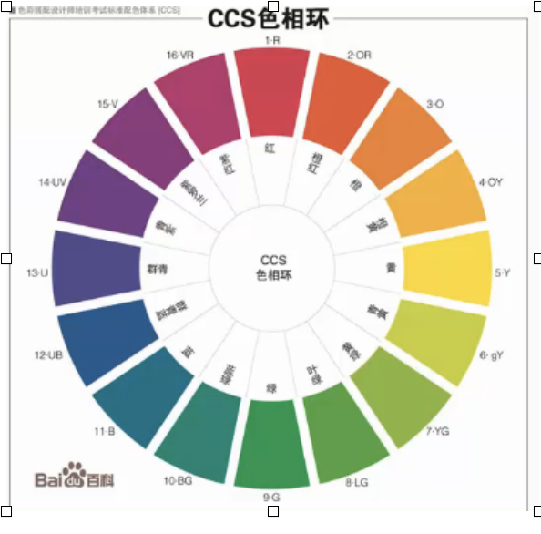
    2. **S(saturation)** 表示饱和度，表示色彩的鲜艳程度
        1. 取值范围：0%到100%
        2. 饱和度越高，色彩越鲜艳
        3. 饱和度越低，色彩越暗淡
        4. 完全不饱和的颜色没有色相，如黑白之间的各种灰色
    3. **L(lightness)** 表示亮度，控制色彩的明暗变化
        1. 取值范围：0%到100%
        2. 数值越小，色彩越暗，越接近于黑色
        3. 数值越大，色彩越亮，越接近于白色
3. HSLa颜色：
    1. **a（alpha）**：表示透明度，用法与RGBa中a的用法完全一样

> PS  
> RGB 颜色值和 十六进制颜色 值都是通过调整三原色比例来调整颜色  
> HLS 通过色相，饱和度和亮度来调整颜色，是通过人对颜色的自然感知来调整，调色更容易  

[back to Contents]

#### 2.4.3 CSS 不透明度

`opacity` 属性：用于设置不透明度  

1. 取值范围：0-1
2. 0 表示完全透明
3. 1 表示完全不透明

> PS
> 当为一个元素设置了 `opacity` 属性时，会影响到这个元素本身以及这个元素的所有子孙元素  
> IE8 以及 IE8 以下的 IE浏览器 不支持 opacity 属性，但可以使用以下代码实现相同的效果：`filter：alpha(opacity=值);` 值的范围是 0-100  
> 兼容所有的浏览器要同时使用 opacity 和 filter 属性如：`opacity:0.45; filter:alpha(opacity=45);`

[back to Contents]

#### 2.4.4 CSS 中的渐变

渐变：在两个或多个颜色之间进行平滑的过度  
CSS3 提供了创建颜色简便的方式  

浏览器支持两种简便的方案：

1. **径向渐变**：从元素中心开始向四周放射性渐变，呈椭圆形，默认情况下椭圆的大小会自动匹配所在元素的大小 `radial-gradient(形状 大小 at 位置，第一个颜色，第二个颜色···);`
    1. **形状**：可选值，circle（圆形）、ellipse（椭圆形，默认值）
    2. **大小**：可选值，使用长度（如10px）或百分比（如50%）表示简便的大小  
如：`background：radial-gradient(50px, aqua，blue);`表示径向简便的渐变直径是 50px:  
`background：radial-gradient(80% 20%, aqua，blue);`表示径向渐变的长度是所在元素长度的 80%，宽度是所在元素高度的 20%。  
    3. **at 位置**：可选值，简便开始的位置，center（默认值）left、right、top、button、left top、right top、left bottom 、right bottom
2. **线性渐变**：`background: linear-gradient(to 渐变的方向，渐变的第一个颜色，渐变的第二个颜色···);`
    1. **渐变方向（用方向名称表示）**：Left（左）、right（右）、top（上）、bottom（下）、Left top（左上）、right to（右上）、left bottom（左下）、right bottom（右下）
    2. **渐变方向（用数字表示角度）**：
        1. 取值范围：0-100
        2. 单位：deg（degree 的缩写）渐变方向如图  
        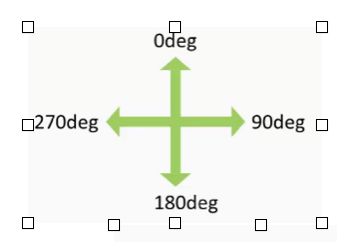
        3. **颜色列表**：两个或多个颜色的组合，用逗号分开，可以用任何颜色表示方法表示颜色。

```css
div { width:200px; height: 200px; border-radius: 50%; /* 边框圆角为50%,为圆形 */
      background: radial-gradient(at left top, aqua, blue); /* 径向渐变会产生有立体视觉效果的球形(见右图) */
}
```

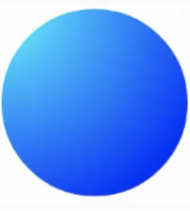

[back to Contents]

### 2.5 CSS3 中“盒子”的尺寸

1. `box-sizing`属性：用来改变合模式中盒子的高度和宽度的默认的计算方式
2. 盒模式：HTML 中每个元素都是一个盒子，由 4 部分组成
    1. 内容区域
    2. 内边距 padding
    3. 边框 border
    4. 外边距 margin
3. 盒子的总宽度 = 内容区域 + padding + border + margin
4. 盒子的总高度 = 内容区域 + padding + border + margin
5. 图中的代码样式如下

```css
width: 300px;
height: 100px;
padding: 10px;
border: 2px;
margin: 20px;
box-sizing: content-box
// 默认值，此时 width 和 height 只表示内容区域的宽和高
```

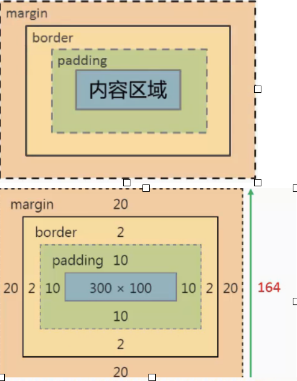

图中的代码样式如下

```css
width: 300px;
height: 100px;
padding: 10px;
border: 2px;
margin: 20px;
box-sizing: border-box
// 此时 width 和 height 表示内容区域 + padding + border 的宽和高的总和
```

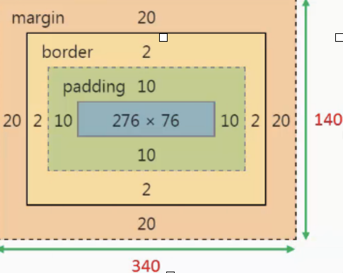

[back to Contents]

### 2.6 CSS3 中背景的新特性

#### 2.6.1 CSS3 为一个元素设置多张背景图片（background-image）

CSS3 允许为一个元素设置多张背景图片，用逗号分开多张图片的属性值，先定义的图片会显示在宏定义的图片的前面  
`background-image: url(“1. png”),url(“2.png”);` 1.png 会显示在 2.png 的前面  
`background-position: top left, center right;` top left 是 1png 的属性，center right 是 2.png 的属性，属性与图片是一一对应的  
`background-repeat: no-repeat, no-repeat;` 同理  

```css
background: 
url(“1.png”) top left no-repeater,
url(“2.png”) center right no-repeater;
// 实现的效果同上
```

[back to Contents]

#### 2.6.2 CSS3 为图片重新定义一个尺寸（background-size）

`background—size` 值的四种形式  

1. **长度**：设置背景图片的高度和宽度，第一个值为宽度，第二个值为高度，如果只设置了一个值，那么第二个值为“auto”自动
2. **百分比**：设置背景图片的高度和宽度分别是当前元素的百分比值
3. **cover**：保持图片的长宽比例，并将图片缩放到刚好能完全覆盖所在区域的最小大小 // 当设置了 `no-repeater` 属性时，图片通常会超出元素而无法完全显示在元素中
4. **contain**：保持图像的长宽比例，并且图像缩放成刚好完全显示在所在区域内的最大大小 // 当设置了 `no-repeater` 属性时，图像一定会完全显示在元素中，但通常不能充满元素区域而留有空白。

[back to Contents]

#### 2.6.3 CSS3 中定义背景图片的定位区域（background-origin）

`background-origin` 的值  

1. `border-box` 背景图片以边框为基准定位

图中的代码如下：

```css
width: 250px;
height: 150px;
padding: 30px;
margin: 10px;
border: 30px dotted #CC0000;
background-image: url(1.png) no-repeater;
border-origin: border-box;
// 背景图片会渗入到边框中显示
```

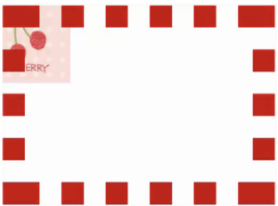

2. `padding-box`（默认值）背景图片会在边框内测（padding区域）定位显示

图中的代码如下：  

```css
width: 250px;
height: 150px;
padding: 30px;
margin: 10px;
border: 30px dotted #CC0000;
background-image: url(1.png) no-repeater;
border-origin: padding-box;
// 背景图片会在边框内测定位显示
```

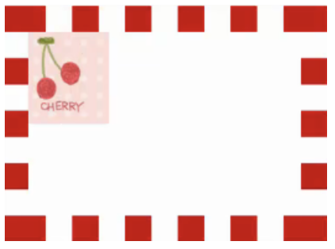

3. `content-box` 背景图片会显示在元素的内容区域

图中的代码如下：

```css
width: 250px;
height: 150px;
padding: 30px;
margin: 10px;
border: 30px dotted #CC0000;
background-image: url(1.png) no-repeater;
border-origin: content-box;
// 背景图片显示在元素的内容区域
```

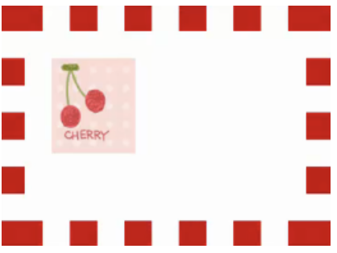

#### 2.6.4 CSS3 定义图片的剪裁区域（background-clip）

`background-clip` 的值

1. `border-box`（默认值）剪裁超出元素边框的背景图片

图中的代码如下：

```css
width: 250px;
height: 150px;
padding: 30px;
margin: 10px;
border: 30px dotted #CC0000;
background-image: url(1.png) no-repeater:
border-origin: border-box;
background-clip: border-box;
// 超出元素边框的背景图片会被裁剪
```

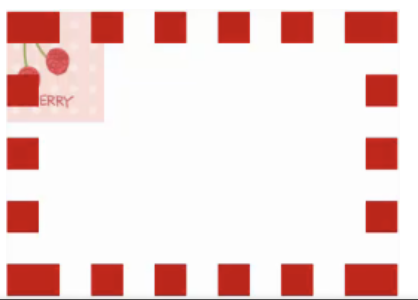

2. `padding-box` 剪裁超出元素内边距区域的背景图片

图中的代码如下：

```css
width: 250px;
height: 150px;
padding: 30px;
margin: 10px;
border: 30px dotted #CC0000;
background-image: url(1.png) no-repeater;
border-origin: border-box;
background-clip: padding-box;
// 超出元素内边框的背景图片会被裁剪
```

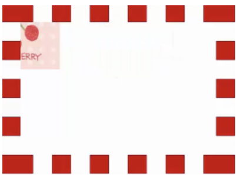

3. `content-box` 剪裁超出元素内容区域的背景图片

右图中的代码如下：

```css
width: 250px;
height: 150px;
padding: 30px;
margin: 10px;
border: 30px dotted #CC0000;
background-image: url(1.png) no-repeater:
border-origin: border-box;
background-clip: content-box;
// 超出元素内容区域的推片会被裁剪
```

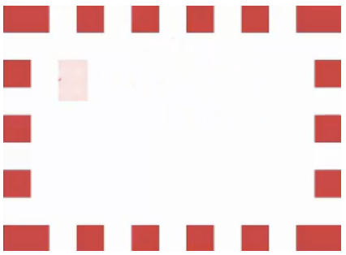

> PS: `background` 属性的完整简写形式  
> `background: 背景颜色 背景图片 是否平铺 图片位置/图片尺寸 定位区域 剪裁区域`  

[back to Contents]

### 2.7 Web 字体

`font-family: 字体名1，字体名2···，sans-serif;`  
以上 `font-family` 属性后放置了一个字体系列，在页面加载时浏览器会依序从第一种字体开始加载，如用户计算机中有第一种字体，浏览器就会将设置了该字体的元素的文本以该字体显示；如果用户计算机中没有该字体，那么浏览器会查找第二种字体，以此类推，直到找到一种字体为止；若在用户计算机中找不到任何一种相匹配的字体，浏览器会在字体系列中找一种默认的字体。  

特殊字体的使用  

1. 方法一：使用图片代替文字
2. 方法二：使用 web 字体: `@font-face` 规则
    1. 下载 web 字体
    2. 确保找到所有需要的字体格式

| 字体格式 | 扩展名 | 说明 |
| :----: | :---: | ---- |
| Truetype | .ttf | 中文名称全真字体，由 apple 公司和 microsoft 公司联合提出
| Opentype | .otf | 建立在 truetype 基础之上
| Embedded | .eot | Opentype 的一种压缩形式，微软专用，仅IE支持
| SVG 字体 | .svg | SVG 是一种通用图像格式，SVG 字体是使用这种格式显示字符
| Web开放字体 （web open font format）| .woff | 建立在 truetype 基础之上，已经发展为 web 字体的一个事实标准，如今所有现代的浏览器对 woff 格式提供了支持
    3. 将准备好的文件放在web服务器上
    4. 在 css 中定义 `@font-face` 规则

```css
@font-face{
    Font-family: “name”;
    /* name：指定一个自提名以便以后使用 */
    Src: url(“url1”),
    Src: url(“url2”)…;
    /* url1、url2 等：字体文件的地址 */
}
```

    4. 在 css 中使用字体 `font-family: name;`

[back to Contents]

### 2.8 CSS3 中的 2D 转换

1. 转换: transform
    1. translate（移动）
    2. rotate（旋转）
    3. scale（缩放）
    4. skew（倾斜）
2. 2D 转换：在二维空间内转换
    1. `translate(x, y)`：使用 `transform` 中的 2D转换函数 `translate` 将元素在 x 轴和 y 轴上进行移动
        1. x：x 轴的移动距离，可以是长度值，也可以是百分比值，也可用 `translateX` 函数单独设置
        2. y：y 轴的移动距离，可以是长度值，也可以是百分比值，可选，默认为 0，`translateY` 单独设置
    2. `rotate()`：函数 `rotate` 可根据指定的角度旋转元素，  
        单位：deg（度），正数表示顺时针旋转，负数表示逆时针旋转
    3. `scale(x,y)`：函数 `scale` 可将元素放大或缩小
        1. x：表示在 x 轴的放大倍数，可用 `scaleX` 函数单独设置
        2. y：表示在 y 轴的放大倍数，可选值，默认与 x 的值相同，可用 `scaleY` 函数单独设置
    4. `skew(X,Y)`：将元素沿 x 轴和 y 轴倾斜显示
        1. x：表示沿 x 轴倾斜的角度，可用 `scaleX` 单独设置
        2. y：表示沿 y 轴倾斜的角度，可选默认为 0，可用 `scaleY` 单独设置
    5. `matrix(a, b, c, d, e, f)`：转换基准点 `transform-origin：X,Y,Z`
        1. CSS 中默认的转换基准点是元素的中心点，使用 `transform-origin` 属性可以更改元素的转换基准点。
        2. x：表示在 x 轴的转换基准点，默认值为 50%（center），可能值：left right center 长度 百分比
        3. y：表示在 y 轴的转换基准点，默认值为 50%（center），可能值：top bottom center 长度 百分比
        4. z：表示在 z 轴的转换基准点，默认值为 0，可能值：长度
3. 3D 转换：在三维空间内转换

> PS：可在 `transform` 属性中使用多个函数，函数之间用空格分开

[back to Contents]

### 2.9 CSS3 过度

过度：一个元素在不同的状态之间进行平滑的转换（`transition` 实现）  
`transition` 属性的用法  
`transition: 过度属性 执行时间 时间函数 延迟时间`  
1. **过度属性（`transition-property`）**：可选值，all（默认值）表示所有，指定将要进行过度变换的 CSS 属性，可分别设置每个属性过度效果的执行时间等值，不同过度属性的值的设置用逗号分开。  
2. **执行时间（`transition-duration`**）：可选值，0s（默认值），指定过度效果从开始执行到结束使用的时间
3. **时间函数（`transition-timingfunction`）**：可选值，设置元素运动的速度(最复杂，涉及贝塞尔曲线)
    1. **贝塞尔曲线和时间函数**(cubic-bezier（p1x, P1Y, P2X, P2Y）)  
        贝塞尔曲线关键字
        1. **ease**(默认值)：cubic-bezier（0.25, 0.1, 0.25, 1. 0）起步慢，立刻快，慢停稳
        2. **linear**（线性的）：cubic-bezier（0, 0, 1, 1）匀速运动
        3. **ease-in**：cubic-bezier (0. 42, 0, 1, 1) 嫌慢，后逐渐变快
        4. **ease-out**：cubic-bezier (0. 0. 0.58. 1) 先快，后逐渐变慢
        5. **ease-in-out**：cubic-bezier (0.42. 0. 0.58. 1) 两边慢，中间快
    2. **步骤函数（`steps()`）**
        1. transition: 2s steps(2, start) // 动画分 2 步进行，且在每段时间开始时执行
        2. transition: 3s steps(3, end) // 动画分 3 步执行，且在每段时间结束时执行
        3. 如果有 transition: 3s steps(1, start) 可写成 transition: 3s steps-start // 一步执行，同理 steps（1，end）可写成 steps-end
4. **延迟时间（`transition-delay`）**：可选值，0s（默认值），设置多长时间后开始执行过度

[back to Contents]

### 2.10 CSS3 动画

1. **逐帧动画**：组成动画的每一个画面就是一个帧
2. **关键帧动画（过度动画）**：`@keyframes` 规则 `animation` 属性，webkit浏览器要加 `-webkit-` 前缀（如 safari chrome 浏览器）`@-webkit-keyframes` 规则 `-webkit-animation` 属性（<=IE9的浏览器哪一种都不支持）

```css
/* 简单的例子 */
div{
    width: 50px; height: 50px; background-color: green;
}
@keyframes myAnimat{ // myAnimat 是定义动画的名字，方便使用
    form{ width: 50px;} // from 定义关键帧动画的起始状态
    to{ width: 200px;} // to 定义关键帧动画的结束状态
}
@-webkit-keyframes myAnimat{ // 为了兼容所有的浏览器再定义一个相同的动画
    form{ width: 50px;} // from 定义关键帧动画的起始状态
    to{ width: 200px;} // to 定义关键帧动画的结束状态
}
div: hover{
    animation-name: myAnimat; // 使用 myAnimat 动画
    animation-duration: 2s; // 动画持续 2 秒,与 CSS3 过度中的transition-duration 相同
}
/* 也可以用百分比定义关键帧动画的关键帧 */
@keyframes animat2{
    0% {width: 50px} // 第一帧动画，刚开始时
    50% { width: 100px} // 中间时刻的关键帧（如总时间为 2s，此为 1s 时的关键帧）
    100% { width: 200px;} // 最后一刻（动画结束时）的关键帧
} // 可定义多个时刻的关键帧，无限制
```

1. 时间函数  
`[-webkit-]animation-timing-function` 与 CSS3 过度中的`transition-timingfunction` 用法相同
2. 延迟函数  
`[-webkit-]animation-delay` 与 CSS3 过度中的 `transition-delay` 用法相同
3. 动画执行次数：
`animation-iteration-count: 正整数 | infinite;` // 正整数定义次数（默认为 1，`infinite` 表示正无穷）
4. 动画播放的方向：`animation-direction`
    1. `mormal`(默认值)
    2. `reverse`(动画反方向播放)
    3. `alternate`(第一次正常播放，第二次反向播放)
    4. `alternate—reverse`(第一次反向播放，第二从正向播放)
5. 动画播放前后的状态：`animation-fill-mode`
    1. `none`(默认值)
	2. `backwards`(设置播放之前元素的状态与第一帧的状态相同，而不是元素的默认状态)
	3. `forwards`(设置元素播放之后的状态与最后一帧的状态相同，而不是元素的默认状态)
	4. `both`(同时结合 `backwards` 和 `forwards` 的属性)
6. 控制动画运行或暂停：`animation-play-state`
    1. `running`(默认值，播放)
    2. `paused`（暂停）

> `animation` 属性的简写形式：`animation: animation-name animation-duration animation-delay` …  
> 至少有 `animation-name` 和 `animation-duration` 两个属性，
`animation-duration` 必须在 `animation-delay` 之前，其他无限制

[back to Contents]

---

## 参考链接

兼容性：  

[Can I Use](https://caniuse.com)  

web 技术文档：  

[MDN Web 文档](https://developer.mozilla.org/zh-CN/)  
[MDN Web 文档 - 教程](https://developer.mozilla.org/zh-CN/docs/Web/Tutorials)  

HTML：  

[MDN Web 文档 - HTML](https://developer.mozilla.org/zh-CN/docs/Web/HTML)  
[MDN Web 文档 - HTML5](https://developer.mozilla.org/zh-CN/docs/HTML/HTML5)  
[MDN Web 文档 - HTML 元素参考](https://developer.mozilla.org/zh-CN/docs/Web/HTML/Element)  
[MDN Web 文档 - HTML 属性参考](https://developer.mozilla.org/zh-CN/docs/Web/HTML/Attributes)  
[MDN Web 文档 - HTML 表单指南](https://developer.mozilla.org/zh-CN/docs/Learn/HTML/Forms)  
[MDN Web 文档 - 校验属性](https://developer.mozilla.org/zh-CN/docs/Web/Guide/HTML/HTML5/Constraint_validation)  
[MDN Web 文档 - 发送表单数据](https://developer.mozilla.org/zh-CN/docs/Learn/HTML/Forms/Sending_and_retrieving_form_data)  
[MDN Web 文档 - 表单数据验证](https://developer.mozilla.org/zh-CN/docs/Learn/HTML/Forms/Form_validation)  
[MDN Web 文档 - 原生表单小部件](https://developer.mozilla.org/zh-CN/docs/Learn/HTML/Forms/The_native_form_widgets)  
[MDN Web 文档 - 表单组件兼容性列表](https://developer.mozilla.org/zh-CN/docs/Learn/HTML/Forms/Property_compatibility_table_for_form_widgets)  

CSS：  

[MDN Web 文档 - CSS](https://developer.mozilla.org/zh-CN/docs/Web/CSS)  
[MDN Web 文档 - CSS 参考](https://developer.mozilla.org/zh-CN/docs/Web/CSS/Reference)  
[MDN Web 文档 - CSS 教程](https://developer.mozilla.org/zh-CN/docs/Learn/CSS)  
[MDN Web 文档 - CSS 动画](https://developer.mozilla.org/zh-CN/docs/Web/CSS/CSS_Animations/Using_CSS_animations)  

眼神：  

[WebBase](https://chanmenglin.github.io/WebBase/) | [Github](https://github.com/ChanMenglin/WebBase)  
[Web-Security(Web 安全)](https://github.com/ChanMenglin/WebSecurity)  
[WebOptimize(Web 优化)](https://chanmenglin.github.io/WebOptimize/) | [Github](https://github.com/ChanMenglin/WebOptimize)  
